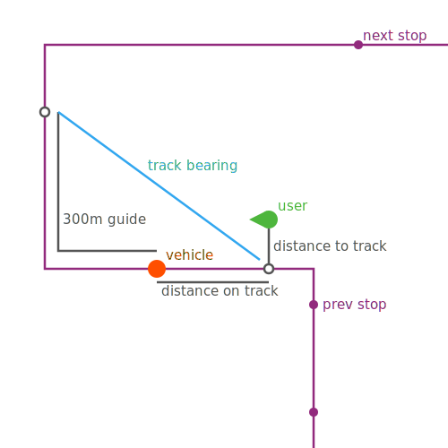

# hafas-find-trips

**Provide location and bearing, get the public transport vehicle you're most likely in.**

Location and bearing are expected to be inaccurate because they come from a mobile device. Also, The vehicle movements from [the underlying `radar()` API](https://github.com/public-transport/hafas-client/blob/0840d69ee9cc0fb9b4bf35237fa93f677991bd7d/docs/journey-leg.md) are often *not* the actual position, but the estimated position, based on their current delays and their track. To compensate for this, `hafas-find-trips`

- filters by product if you provide one,
- checks if the location is close to where vehicles have recently been or will soon be,
- takes the bearing of each vehicle into account.



[](https://www.npmjs.com/package/hafas-find-trips)

[](https://gitter.im/derhuerst)
[](https://patreon.com/derhuerst)


## Installation

```shell
npm install hafas-find-trips
```


## Usage

If possible, provide location, bearing and product. An example from Berlin:

```js
const query = {
	// U6 tunnel, northbound
	latitude: 52.496633,
	longitude: 13.390944,
	bearing: 16, // degrees, 0 is north
	product: 'subway'
}
```

If you don't provide the product, `hafas-find-trips` will instead apply its heuristic to all vehicles nearby. If you don't provide a bearing, it will estimate purely on the distance to the track of each vehicle.

```js
const findTrips = require('hafas-find-trips')
const hafas = require('vbb-hafas')

findTrips(hafas, query)
.then((matches) => {
	for (let match of matches) {
		const m = match.movement
		console.log(match.score, m.line.name, m.direction, m.location)
	}
})
.catch((err) => {
	console.error(err)
	process.exitCode = 1
})
```


## Contributing

If you have a question or have difficulties using `hafas-find-trips`, please double-check your code and setup first. If you think you have found a bug or want to propose a feature, refer to [the issues page](https://github.com/derhuerst/hafas-find-trips/issues).
